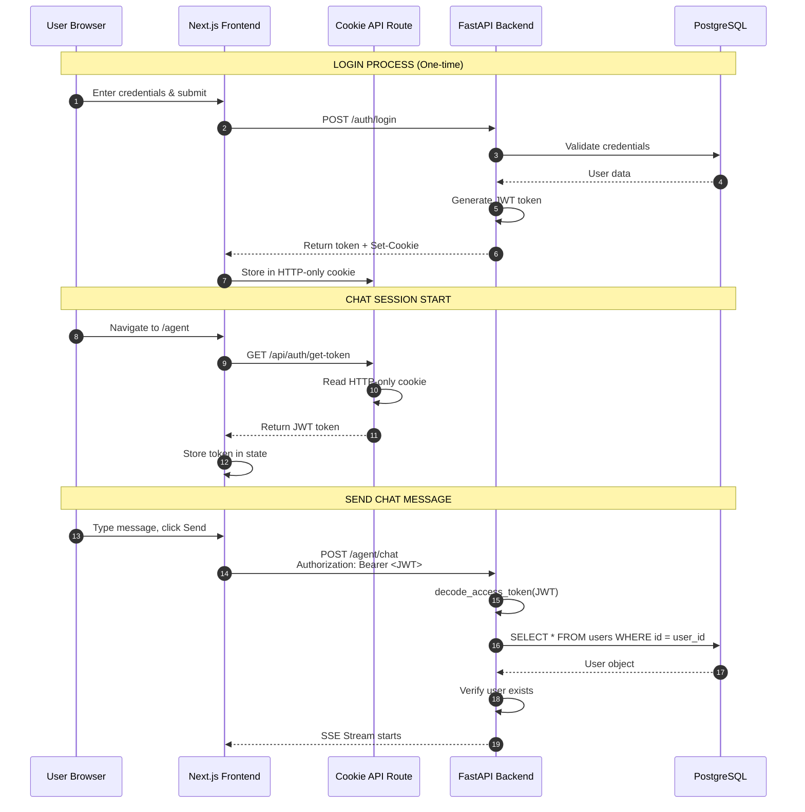
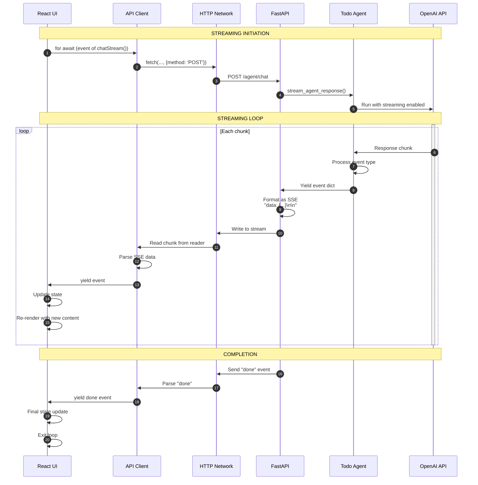
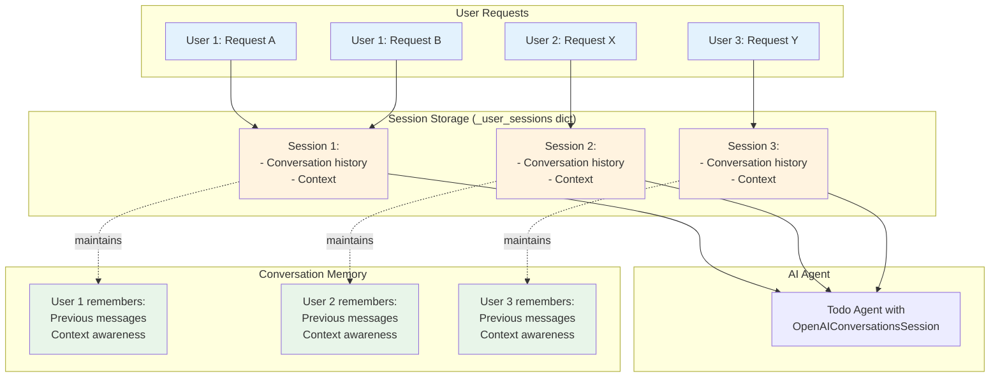
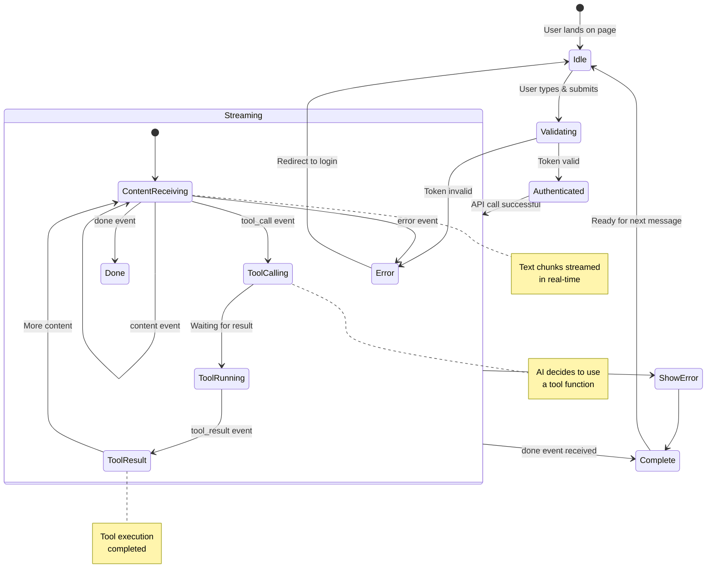
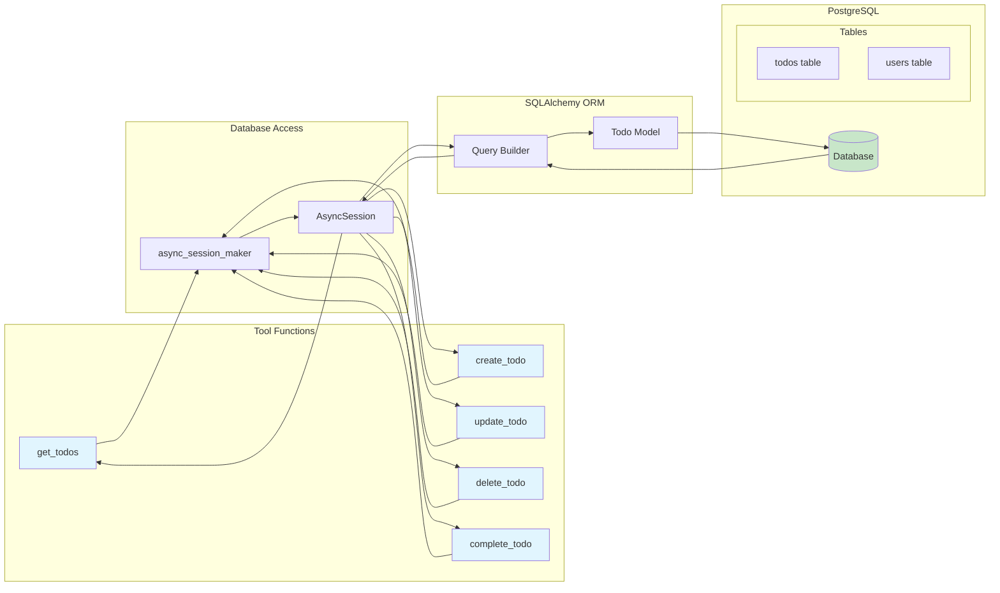
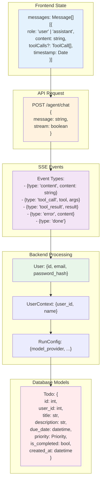

# Todo Agent - Chat Workflow Diagrams

> Visual representations of the agent/chat system architecture and data flows.

---

## 1. Complete System Architecture

```mermaid
graph TB
    subgraph "Client Side - Browser"
        UI[Chat UI Component]
        State[React State Management]
        APIClient[API Client Layer]
        CookieMgr[Cookie Manager]
    end

    subgraph "API Layer - Next.js"
        GetToken[/api/auth/get-token]
        SetToken[/api/auth/set-token]
    end

    subgraph "Network - HTTP/HTTPS"
        Request[HTTP Request + JWT]
        SSE[SSE Stream Response]
    end

    subgraph "Backend - FastAPI"
        Router[/agent/chat Router]
        Auth[Auth Middleware]
        Agent[Todo Agent]
        SessionMgr[Session Manager]
        ToolExecutor[Tool Executor]
        Guardrails[Input Guardrails]
    end

    subgraph "AI Services"
        LLM[OpenAI / OpenRouter API]
    end

    subgraph "Data Layer"
        DB[(PostgreSQL Database)]
        Sessions[In-Memory Sessions]
    end

    %% Connections
    UI --> State
    State --> APIClient
    APIClient --> CookieMgr
    CookieMgr --> GetToken
    CookieMgr --> SetToken

    APIClient -->|POST /agent/chat| Request
    Request --> Router
    Router --> Auth
    Auth --> Agent

    Agent --> SessionMgr
    SessionMgr --> Sessions

    Agent --> Guardrails
    Agent --> ToolExecutor
    ToolExecutor --> DB
    Agent --> LLM
    LLM --> Agent

    Agent -->|Yield events| Router
    Router --> SSE
    SSE --> APIClient
    APIClient --> State
    State --> UI

    %% Styling
    classDef frontend fill:#e3f2fd,stroke:#1976d2,stroke-width:2px
    classDef backend fill:#fff3e0,stroke:#f57c00,stroke-width:2px
    classDef database fill:#e8f5e9,stroke:#388e3c,stroke-width:2px
    classDef ai fill:#f3e5f5,stroke:#7b1fa2,stroke-width:2px
    classDef network fill:#fce4ec,stroke:#c2185b,stroke-width:2px

    class UI,State,APIClient,CookieMgr frontend
    class Router,Auth,Agent,SessionMgr,ToolExecutor,Guardrails backend
    class DB,Sessions database
    class LLM ai
    class Request,SSE network
```

---

## 2. Authentication Flow



---

## 3. Message Processing Flow

```mermaid
flowchart TD
    Start([User sends message]) --> Validate[Message validation]
    Validate -->|Invalid| Error1[Return error]
    Validate -->|Valid| AuthCheck[Check JWT token]

    AuthCheck -->|No token| Redirect[Redirect to /login]
    AuthCheck -->|Token exists| Decode[Decode JWT]

    Decode -->|Invalid token| Error2[Return 401 error]
    Decode -->|Valid token| GetUser[Get user from DB]

    GetUser -->|Not found| Error3[Return 401 error]
    GetUser -->|Found| GetSession[Get user session]

    GetSession --> CreateAgent[Create agent with user context]
    CreateAgent --> RunAgent[Run agent with streaming]

    RunAgent --> CheckTools{Does AI need<br/>to call tools?}

    CheckTools -->|No| StreamText[Stream text response]
    CheckTools -->|Yes| CallTool[Call tool function]

    CallTool --> DBQuery[Query database]
    DBQuery --> GetResult[Get result]
    GetResult --> ContinueAI[Continue AI with result]

    StreamText --> FormatEvent[Format as SSE event]
    ContinueAI --> FormatEvent
    FormatEvent --> SendEvent[Send to frontend]

    SendEvent --> MoreEvents{More events?}
    MoreEvents -->|Yes| StreamText
    MoreEvents -->|No| Done[Send "done" event]

    Done --> End([Complete])

    style Start fill:#c8e6c9
    style End fill:#c8e6c9
    style Error1 fill:#ffcdd2
    style Error2 fill:#ffcdd2
    style Error3 fill:#ffcdd2
    style Redirect fill:#ffcdd2
    style SendEvent fill:#fff9c4
    style Done fill:#b3e5fc
```

---

## 4. Server-Sent Events (SSE) Flow



---

## 5. Tool Execution Flow

```mermaid
flowchart TD
    Start([Agent determines tool needed]) --> GetContext[Get UserContext]

    GetContext --> Inject[Inject user_id into tool call]
    Inject --> ToolFunc[Call tool function]

    ToolFunc --> DBSession[Get DB session]
    DBSession --> Query[Build query with user_id filter]

    Query --> Execute[Execute SQL query]
    Execute --> Result[Get result from DB]

    Result --> Format{Is result<br/>successful?}

    Format -->|No| NotFound[Return "not found" message]
    Format -->|Yes| FormatSuccess[Format result for display]

    NotFound --> Return[Return formatted string to AI]
    FormatSuccess --> Return

    Return --> AIProcess[AI includes in response]
    AIProcess --> Stream[Stream to user]

    NotFound2{Is query result<br/>empty?} -->|Yes| EmptyMsg[Return "no todos" message]
    NotFound2 -->|No| BuildList[Build todo list]
    EmptyMsg --> Return
    BuildList --> Return

    style Start fill:#e1bee7
    style Stream fill:#c8e6c9
    style Return fill:#fff9c4
    style Query fill:#bbdefb
```

---

## 6. Session Management



---

## 7. Event Types Flow



---

## 8. Database Layer Interaction



---

## 9. Complete Data Structure Flow



---

## 10. Error Handling Flow

```mermaid
flowchart TD
    Start([User Action]) --> FE Try{Frontend<br/>Try/Catch}
    FE Try -->|Success| APICall[Make API Call]
    FE Try -->|Error| FEError[Show error in UI]

    APICall --> BE Try{Backend<br/>Try/Catch}
    BE Try -->|Success| AgentRun[Run Agent]
    BE Try -->|Error| BEError1[Yield error event]

    AgentRun --> AgentTry{Agent<br/>Try/Catch}
    AgentTry -->|Success| LLMCall[Call LLM]
    AgentTry -->|Error| BEError2[Yield error event]

    LLMCall --> ToolTry{Tool<br/>Try/Catch}
    ToolTry -->|Success| DBQuery[Query DB]
    ToolTry -->|Error| ToolError[Return error message]

    DBQuery --> DBCheck{DB<br/>Error?}
    DBCheck -->|No| Success[Return result]
    DBCheck -->|Yes| DBError[Log error, return None]

    Success --> Stream[Stream result]
    ToolError --> Stream
    Stream --> End([Complete])

    BEError1 --> SSEError[Send SSE error]
    BEError2 --> SSEError
    SSEError --> End
    FEError --> End

    style Start fill:#c8e6c9
    style End fill:#c8e6c9
    style FEError fill:#ffcdd2
    style BEError1 fill:#ffcdd2
    style BEError2 fill:#ffcdd2
    style ToolError fill:#ffcdd2
    style DBError fill:#ffcdd2
    style Success fill:#c8e6c9
    style Stream fill:#b3e5fc
```

---

*These diagrams are interactive in compatible markdown viewers. For the best viewing experience, use a markdown renderer that supports Mermaid.js.*
