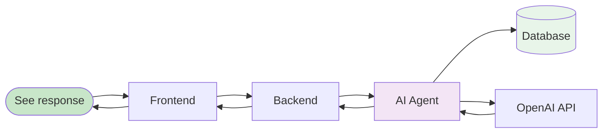
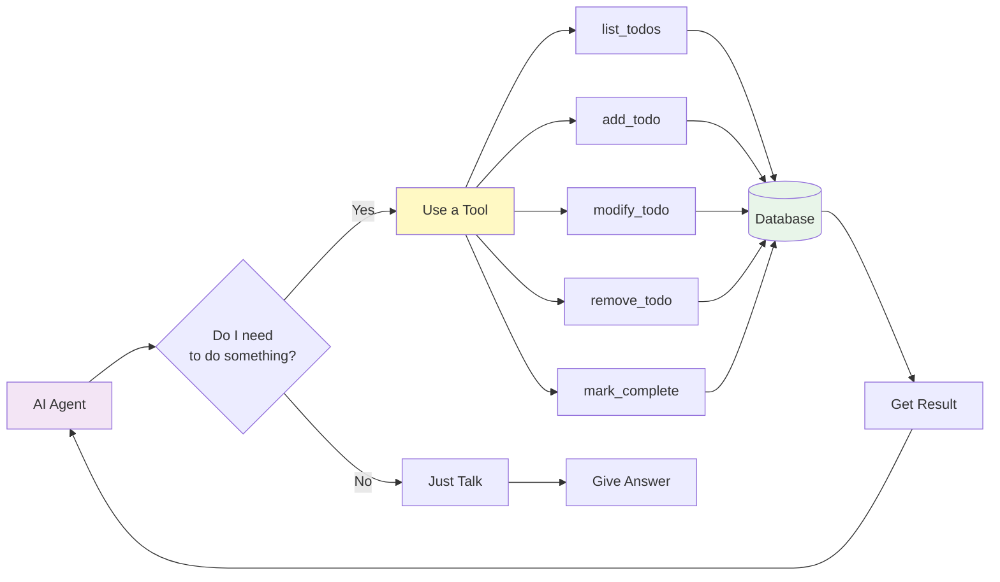

# Todo Agent - Chat Quick Reference Guide

> A simplified, beginner-friendly guide to understanding the agent/chat workflow.

---

## What Happens When You Send a Message?

### The Simple Version



---

## The 5 Main Steps

### Step 1: Your Message is Captured (Frontend)

**Location**: `frontend/src/app/agent/page.tsx`

```typescript
// When you click Send:
1. Your message is stored in React state
2. It appears immediately on screen (right side)
3. The "loading" animation starts
```

**What you see**: Your message appears in a blue bubble on the right.

---

### Step 2: Token Retrieved (Authentication)

**Location**: `frontend/src/app/api/auth/get-token/`

```typescript
// Get the JWT token from cookie
const token = await getAuthToken();  // Like getting your ID card
```

**Why**: This proves you are who you say you are. The token was created when you logged in.

**Key Concept**: JWT (JSON Web Token) = Your digital ID card, stored in a secure cookie.

---

### Step 3: API Call Made (Network)

**Location**: `frontend/src/lib/api.ts`

```typescript
// Send to backend with your ID
fetch("/agent/chat", {
  method: "POST",
  headers: {
    "Authorization": `Bearer ${token}`  // "Here's my ID"
  },
  body: JSON.stringify({ message })     // "Here's my question"
})
```

**What happens**:
1. Your message + token are sent to the backend
2. Backend checks: "Is this token valid?"
3. Backend extracts your user ID from the token

---

### Step 4: Backend Processing (The Magic Happens!)

**Location**: `backend/app/api/agent.py` → `backend/app/agent/agent.py`

```python
# 1. Check your ID
user = get_current_user(token)  # "You are user #123"

# 2. Get your conversation session
session = get_user_session(user.id)  # "Get your chat history"

# 3. Create AI agent with your context
agent = create_agent()

# 4. Tell the AI who you are
user_context = UserContext(user.id)  # "Remember, this is user #123"

# 5. Run the agent
result = Runner.run_streamed(
    agent,
    message,
    session,     # Your chat history
    user_context # Your user ID
)
```

**Why this matters**:
- Your session = conversation memory (AI remembers what you said before)
- Your context = your ID (so AI only accesses YOUR todos)

---

### Step 5: AI Thinks & Responds (Streaming)

**Location**: `backend/app/agent/agent.py`

```python
# The AI streams its response back
async for event in result.stream_events():
    if event.type == "content":
        yield {"type": "content", "content": "Hello"}      # Text chunk
    elif event.type == "tool_call":
        yield {"type": "tool_call", "tool": "add_todo"}    # Using a tool
    elif event.type == "tool_result":
        yield {"type": "tool_result", "result": "Done"}    # Tool finished
```

**What you see**: Text appears word-by-word, like someone is typing in real-time!

---

## Understanding Tools

### What are Tools?

Tools are actions the AI can perform. Think of them as "skills" the AI has.



### Example Tool Call

**You say**: "Add a todo for my meeting tomorrow"

**AI thinks**: "I need to use the `add_todo` tool!"

**AI does**:
```python
add_todo(
    user_id=123,        # Your ID (auto-filled!)
    title="meeting",    # From your message
    due_date="2025-03-01"
)
```

**Database**:
```sql
INSERT INTO todos (user_id, title, due_date)
VALUES (123, 'meeting', '2025-03-01');
```

**AI responds**: "I've added your meeting todo for tomorrow!"

---

## Key Concepts Explained

### 1. JWT Token

```
JWT Token = "eyJhbGciOiJIUzI1NiIsInR5cCI6IkpXVCJ9..."
            ↓
When decoded = {
  "sub": "123",        # Your user ID
  "exp": 1740883920,   # When it expires
  "iat": 1740279120    # When it was created
}
```

**Analogy**: Like a hotel key card - it proves you're a guest and which room is yours.

### 2. Sessions

```python
# Stored in memory
_user_sessions = {
    123: SessionObject,  # User 123's chat history
    456: SessionObject,  # User 456's chat history
    789: SessionObject   # User 789's chat history
}
```

**Analogy**: Like a conversation notebook - each user has their own.

### 3. SSE (Server-Sent Events)

```
What you see: "Hello, how can I help?"

What's being sent:
data: {"type": "content", "content": "Hello"}
data: {"type": "content", "content": ", how"}
data: {"type": "content", "content": " can I help"}
data: {"type": "content", "content": "?"}
data: {"type": "done"}
```

**Analogy**: Like receiving a letter piece by piece, instead of waiting for the whole thing.

### 4. User Context

```python
class UserContext:
    user_id: int  # YOUR user ID

# When AI calls a tool, user_id is automatically inserted
add_todo(user_id=123, title="meeting")  # user_id filled in automatically!
```

**Analogy**: Like having your pre-filled name tag on everything you do.

---

## Data Flow Summary

```
┌─────────────────────────────────────────────────────────────┐
│                    YOUR MESSAGE FLOW                         │
├─────────────────────────────────────────────────────────────┤
│                                                               │
│  YOU → Frontend → Token → API → Backend → Auth → Agent      │
│                                                               │
│                                    ↓                          │
│                              (Knows you're user #123)        │
│                                    ↓                          │
│  LLM ← AI ← Tools ← Database → (filtered by user_id)        │
│                                                               │
│  Then streamed back:                                         │
│  Agent → Backend → SSE → Frontend → YOU (see it appear!)    │
│                                                               │
└─────────────────────────────────────────────────────────────┘
```

---

## Event Types You'll See

| Event | What You See | What's Happening |
|-------|--------------|------------------|
| `content` | Text appears | AI is "speaking" |
| `tool_call` | "Running: add_todo" | AI is doing something |
| `tool_result` | "Completed: add_todo" | Action finished |
| `error` | Red error message | Something went wrong |
| `done` | Response complete | AI finished talking |

---

## File Locations (For Developers)

| What | Where |
|------|-------|
| Chat UI | `frontend/src/app/agent/page.tsx` |
| API Calls | `frontend/src/lib/api.ts` |
| Auth Cookies | `frontend/src/app/api/auth/` |
| Backend Endpoint | `backend/app/api/agent.py` |
| Agent Logic | `backend/app/agent/agent.py` |
| Tools | `backend/app/agent/tools.py` |
| Auth Validation | `backend/app/dependencies.py` |

---

## Quick Debugging Tips

| Problem | Likely Cause | Check |
|---------|--------------|-------|
| "Redirected to login" | No token | Is cookie set? |
| "401 Unauthorized" | Invalid token | Did token expire? |
| "No response" | Backend error | Check server logs |
| Can't see todos | Wrong user_id | Is database query filtered? |
| Tools not working | Agent context | Is user_id being injected? |

---

## Common Questions

**Q: How does the AI remember our conversation?**
A: Sessions! Each user gets a `OpenAIConversationsSession` that stores chat history.

**Q: How does it know which todos are mine?**
A: Every database query includes `WHERE user_id = ?` with YOUR user ID.

**Q: What if I refresh the page?**
A: Your session is still in memory (until server restart), but the UI clears.

**Q: Can two users chat at the same time?**
A: Yes! Each user gets their own session and context.

---

*For detailed documentation, see `AGENT_CHAT_WORKFLOW.md`*
*For diagrams, see `AGENT_CHAT_DIAGRAMS.md`*
