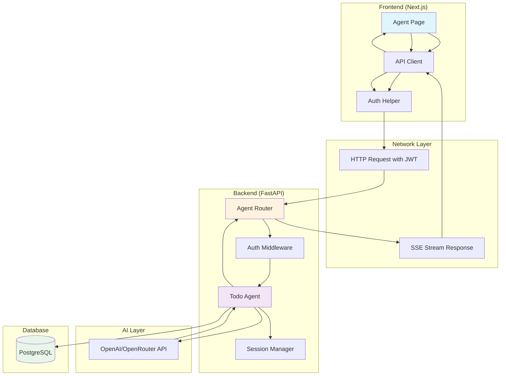
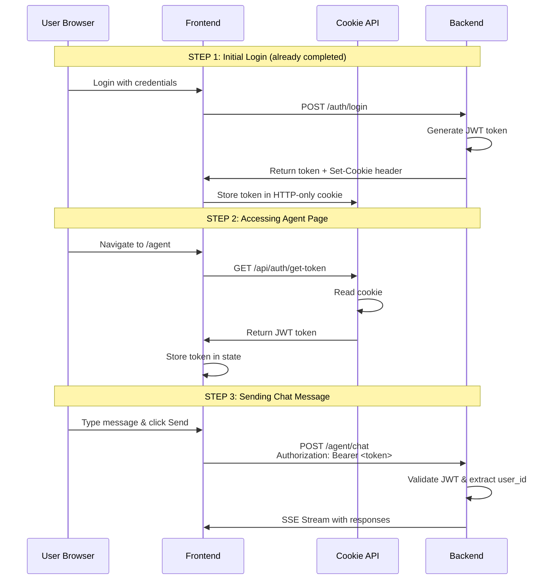
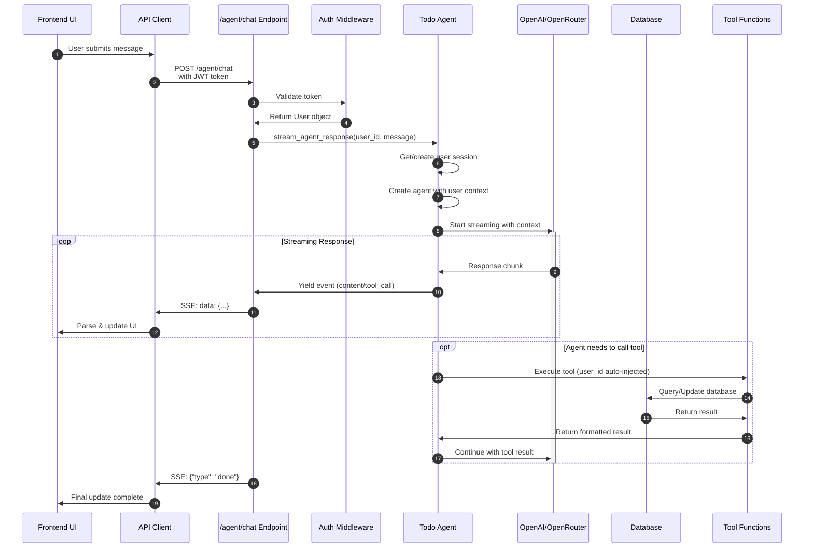
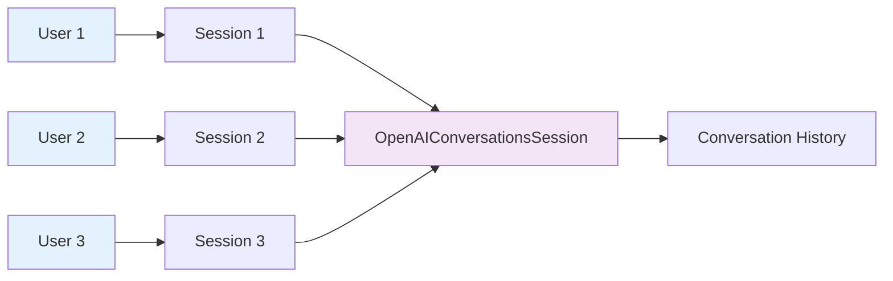
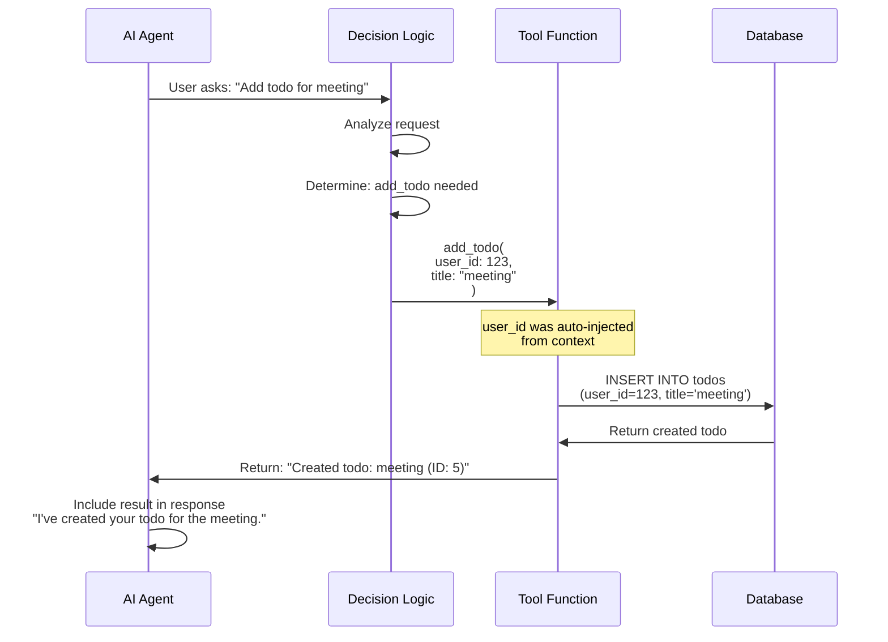
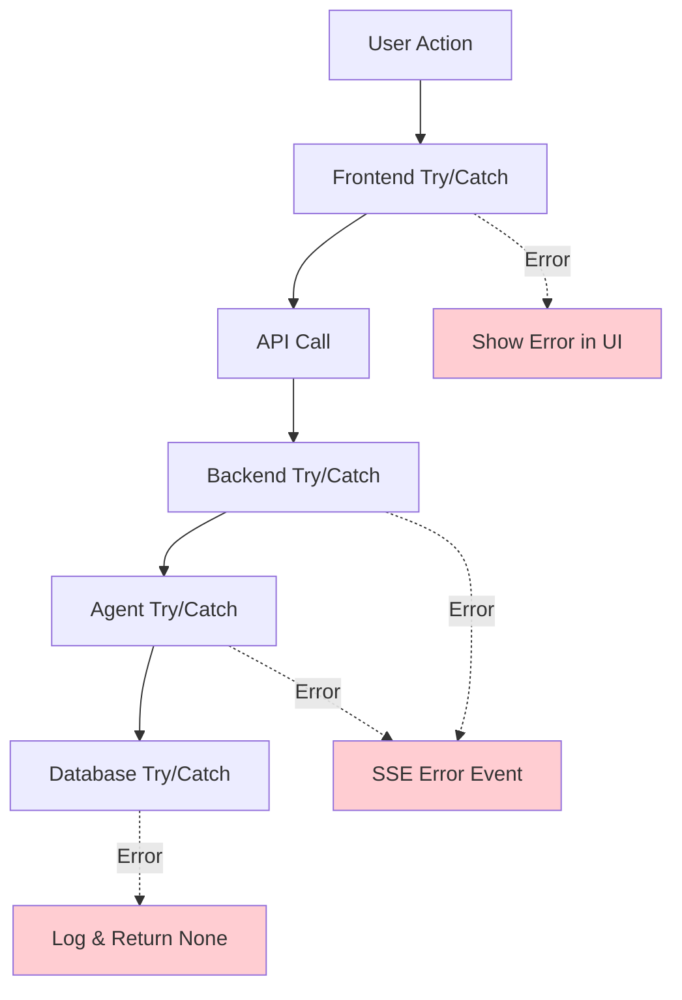

# Todo Agent - End-to-End Chat Workflow Documentation

> A complete guide to understanding how the `/agent/chat` feature works from frontend to backend, designed for junior developers and trainees.

---

## Table of Contents

1. [Overview](#overview)
2. [Architecture Diagram](#architecture-diagram)
3. [Component Breakdown](#component-breakdown)
4. [Authentication Flow](#authentication-flow)
5. [Complete Request Flow](#complete-request-flow)
6. [Streaming Explained](#streaming-explained)
7. [Agent Session Management](#agent-session-management)
8. [Tool Execution Flow](#tool-execution-flow)
9. [Error Handling](#error-handling)
10. [Key Files Reference](#key-files-reference)

---

## Overview

The Todo Agent chat feature allows users to have real-time conversations with an AI assistant that can:
- Manage their todos (create, read, update, delete)
- Answer IT and coding questions
- Provide task management advice

The communication uses **Server-Sent Events (SSE)** for real-time streaming, giving users immediate feedback as the AI responds.

---

## Architecture Diagram

### High-Level System Architecture



---

## Component Breakdown

### Frontend Components

| Component | File Path | Purpose |
|-----------|-----------|---------|
| **Chat Page** | `frontend/src/app/agent/page.tsx` | Main UI for chat interface |
| **API Client** | `frontend/src/lib/api.ts` | Handles API calls and SSE parsing |
| **Auth Helper** | `frontend/src/app/api/auth/` | Token management via cookies |

### Backend Components

| Component | File Path | Purpose |
|-----------|-----------|---------|
| **Agent Router** | `backend/app/api/agent.py` | `/agent/chat` endpoint |
| **Auth Dependency** | `backend/app/dependencies.py` | JWT validation |
| **Todo Agent** | `backend/app/agent/agent.py` | AI agent logic & streaming |
| **Tools** | `backend/app/agent/tools.py` | Database operations |
| **Guardrails** | `backend/app/agent/guardrails.py` | Input validation |

---

## Authentication Flow

### How User Identity is Established

The application uses **JWT (JSON Web Token)** based authentication stored in HTTP-only cookies for security.



### JWT Token Structure

The JWT token contains:
- **sub**: User ID (subject)
- **exp**: Expiration time (7 days)
- **iat**: Issued at time

### Authentication Code Flow

**Frontend Token Retrieval** (`frontend/src/app/agent/page.tsx:39-50`):
```typescript
useEffect(() => {
  const getToken = async () => {
    const response = await fetch("/api/auth/get-token");
    if (response.ok) {
      const data = await response.json();
      setToken(data.token);  // Store JWT in state
    } else {
      router.push("/login");  // Redirect if no token
    }
  };
  getToken();
}, [router]);
```

**Backend Validation** (`backend/app/dependencies.py:16-42`):
```python
async def get_current_user(
    credentials: Annotated[HTTPAuthorizationCredentials, Depends(security)],
    db: Annotated[AsyncSession, Depends(get_db)],
) -> User:
    """Get the current authenticated user from JWT token."""
    # 1. Extract and decode JWT
    token = credentials.credentials
    payload = decode_access_token(token)
    user_id = int(payload.get("sub"))

    # 2. Verify user exists in database
    result = await db.execute(select(User).where(User.id == user_id))
    user = result.scalar_one_or_none()

    if user is None:
        raise HTTPException(status_code=401, detail="User not found")

    return user  # User object injected into endpoint
```

---

## Complete Request Flow

### End-to-End Message Flow



### Step-by-Step Breakdown

#### Step 1: User Input (Frontend)

**Location**: `frontend/src/app/agent/page.tsx:56-63`

```typescript
const handleSubmit = async (e: React.FormEvent) => {
  e.preventDefault();
  if (!input.trim() || loading || !token) return;

  const userMessage = input.trim();
  setInput("");  // Clear input
  setMessages((prev) => [...prev, {
    role: "user",
    content: userMessage,
    timestamp: new Date()
  }]);  // Show user message immediately
  setLoading(true);
  // ... then call API
};
```

#### Step 2: API Call with Streaming

**Location**: `frontend/src/lib/api.ts:173-224`

```typescript
async *chatStream(token: string, message: string) {
  // 1. Make POST request with streaming enabled
  const response = await fetch(`${API_URL}/agent/chat`, {
    method: "POST",
    headers: {
      "Content-Type": "application/json",
      Authorization: `Bearer ${token}`,  // JWT in header
    },
    body: JSON.stringify({ message, stream: true }),
  });

  // 2. Get readable stream from response
  const reader = response.body?.getReader();
  const decoder = new TextDecoder();
  let buffer = "";

  // 3. Read chunks and parse SSE format
  while (true) {
    const { done, value } = await reader.read();
    if (done) break;

    buffer += decoder.decode(value, { stream: true });
    const lines = buffer.split("\n");
    buffer = lines.pop() || "";

    // 4. Parse SSE events
    for (const line of lines) {
      if (line.startsWith("data: ")) {
        const data = line.slice(6);  // Remove "data: " prefix
        const event = JSON.parse(data);
        yield event;  // Yield to async generator
        if (event.type === "done") return;
      }
    }
  }
}
```

#### Step 3: Backend Endpoint Processing

**Location**: `backend/app/api/agent.py:33-68`

```python
@router.post("/chat", response_model=None)
async def chat_endpoint(
    request: ChatRequest,
    current_user: CurrentUserDep,  # JWT validated automatically
) -> StreamingResponse | ChatResponse:

    async def generate() -> AsyncGenerator[str, None]:
        """Generate SSE events."""
        try:
            # Stream from agent
            async for event in stream_agent_response(
                current_user.id,  # User ID from JWT
                request.message
            ):
                # Format as SSE: "data: {...}\n\n"
                event_data = json.dumps(event)
                yield f"data: {event_data}\n\n"

            # Send completion event
            yield "data: {\"type\": \"done\"}\n\n"

        except Exception as e:
            error_event = json.dumps({"type": "error", "content": str(e)})
            yield f"data: {error_event}\n\n"

    # Return streaming response with SSE headers
    return StreamingResponse(
        generate(),
        media_type="text/event-stream",
        headers={
            "Cache-Control": "no-cache",
            "Connection": "keep-alive",
            "X-Accel-Buffering": "no",  # Disable nginx buffering
        },
    )
```

#### Step 4: Agent Processing

**Location**: `backend/app/agent/agent.py:222-325`

```python
async def stream_agent_response(
    user_id: int,
    message: str,
) -> AsyncIterator[dict]:
    """Stream agent response for a user message."""

    # 1. Create agent with tools and instructions
    agent = create_agent()

    # 2. Get or create user's conversation session
    session = get_user_session(user_id)

    # 3. Create user context (injects user_id into agent)
    user_context = UserContext(user_id)

    # 4. Get LLM client and configure
    client = get_llm_client()
    run_config = RunConfig(
        model_provider=OpenAIProvider(openai_client=client),
        tracing_disabled=True,
    )

    try:
        # 5. Run agent with streaming
        result_streaming = Runner.run_streamed(
            starting_agent=agent,
            input=message,
            session=session,  # Maintains conversation history
            context=user_context,  # User context available to tools
            run_config=run_config,
        )

        # 6. Process streaming events
        async for event in result_streaming.stream_events():
            # Handle content, tool calls, etc.
            # ... (see Streaming section below)

    except Exception as e:
        yield {"type": "error", "content": str(e)}
```

---

## Streaming Explained

### What is SSE (Server-Sent Events)?

Server-Sent Events is a technology that allows servers to push data to clients over HTTP. It's a one-way communication channel perfect for real-time updates.

**SSE Format:**
```
data: {"type": "content", "content": "Hello"}
data: {"type": "content", "content": " world"}
data: {"type": "done"}

```

### Event Types in the System

| Event Type | Purpose | Example Data |
|------------|---------|--------------|
| `content` | Streaming text chunk | `{"type": "content", "content": "Hello"}` |
| `tool_call` | Tool being executed | `{"type": "tool_call", "tool": "add_todo", "args": {...}}` |
| `tool_result` | Tool execution result | `{"type": "tool_result", "result": "Todo created"}` |
| `error` | Error occurred | `{"type": "error", "content": "Error message"}` |
| `done` | Stream complete | `{"type": "done"}` |

### Frontend Event Handling

**Location**: `frontend/src/app/agent/page.tsx:71-93`

```typescript
for await (const event of agentApi.chatStream(token, userMessage)) {
  if (event.type === "content" && event.content) {
    // Accumulate streaming text
    assistantContent += event.content;
    setStreamContent(assistantContent);  // Update UI in real-time
  }
  else if (event.type === "tool_call") {
    // Show tool is being called
    const toolCall = {
      tool: event.tool || "unknown",
      args: event.args || "{}",
    };
    toolCalls.push(toolCall);
    setCurrentToolCalls([...toolCalls]);  // Update UI
  }
  else if (event.type === "tool_result") {
    // Show tool result
    toolCalls[toolCalls.length - 1].result = event.result;
    setCurrentToolCalls([...toolCalls]);
  }
  else if (event.type === "error") {
    // Handle error
    assistantContent += `\n\n**Error:** ${event.content}`;
    setStreamContent(assistantContent);
  }
  else if (event.type === "done") {
    break;  // Stream complete
  }
}
```

### Backend Event Generation

**Location**: `backend/app/agent/agent.py:259-314`

```python
async for event in result_streaming.stream_events():
    if hasattr(event, "type"):
        if event.type == "raw_response_event":
            # Text delta from LLM
            if event.data.type == "response.output_text.delta":
                yield {
                    "type": "content",
                    "content": event.data.delta,
                }

        elif event.type == "run_item_stream_event":
            if event.data.name == "tool_called":
                # Tool execution started
                yield {
                    "type": "tool_call",
                    "tool": raw_item.name,
                    "args": json.dumps(raw_item.arguments),
                }

            elif event.data.name == "tool_output":
                # Tool execution completed
                yield {
                    "type": "tool_result",
                    "result": str(event.data.output)[:500],
                }
```

---

## Agent Session Management

### What are Sessions?

Sessions maintain conversation history for each user. This allows the AI to remember previous messages in the conversation.

### Session Architecture



### Session Storage

**Location**: `backend/app/agent/agent.py:28-37`

```python
# In-memory storage for user sessions
_user_sessions: dict[int, OpenAIConversationsSession] = {}

def get_user_session(user_id: int) -> OpenAIConversationsSession:
    """Get or create a session for a specific user."""
    if user_id not in _user_sessions:
        client = get_llm_client()
        # Create new session for this user
        _user_sessions[user_id] = OpenAIConversationsSession(
            openai_client=client
        )
    return _user_sessions[user_id]

def reset_user_session(user_id: int) -> None:
    """Reset the session (clear history)."""
    if user_id in _user_sessions:
        _user_sessions[user_id].clear_session()
```

### Dynamic Instructions with User Context

The agent needs to know which user is talking so it can:
1. Call tools with the correct `user_id`
2. Provide personalized responses

**Location**: `backend/app/agent/agent.py:21-26, 171-201`

```python
# Context class that holds user information
class UserContext:
    """Context object containing user information."""
    def __init__(self, user_id: int):
        self.user_id = user_id
        self.name = f"User {user_id}"

# Dynamic instructions that include user context
def get_dynamic_instructions(
    context: RunContextWrapper[UserContext],
    agent: Agent[UserContext]
) -> str:
    """Instructions with user ID injected automatically."""
    base_instructions = (
        "You are a helpful AI assistant for a Todo application..."
    )

    # Inject user_id into instructions
    user_info = (
        f"\n\nIMPORTANT: The current user ID is {context.context.user_id}. "
        f"When calling todo tools, always use user_id={context.context.user_id} "
        f"automatically. Do NOT ask the user for their user ID."
    )

    return base_instructions + user_info
```

---

## Tool Execution Flow

### What are Tools?

Tools are functions the AI can call to perform actions, like creating a todo or reading from the database.

### Available Tools

| Tool | Purpose | File Location |
|------|---------|---------------|
| `list_todos` | Get user's todos | `agent.py:48-74` |
| `add_todo` | Create a new todo | `agent.py:77-98` |
| `modify_todo` | Update existing todo | `agent.py:101-130` |
| `remove_todo` | Delete a todo | `agent.py:133-149` |
| `mark_complete` | Mark todo as done | `agent.py:152-168` |

### Tool Execution Flow Diagram



### Tool Definition Example

**Location**: `backend/app/agent/agent.py:77-98`

```python
from agents.tool import function_tool

@function_tool  # This decorator registers it as a tool
async def add_todo(
    user_id: int,  # FIRST PARAM: Auto-injected from context
    title: str,    # User-provided
    description: str | None = None,
    due_date: str | None = None,
    priority: str = "medium",
) -> str:
    """Create a new todo.

    Args:
        user_id: The ID of the current user (AUTO-INJECTED)
        title: The title of the todo
        description: Optional description
        due_date: Optional due date
        priority: Priority level (low, medium, high)

    Returns:
        Confirmation message
    """
    result = await create_todo(user_id, title, description, due_date, priority)
    return f"Created new todo: **{result['title']}** (ID: {result['id']})"
```

### Database Operation Example

**Location**: `backend/app/agent/tools.py:62-100`

```python
async def create_todo(
    user_id: int,
    title: str,
    description: Optional[str] = None,
    due_date: Optional[str] = None,
    priority: str = "medium",
) -> dict:
    """Create a new todo for a user."""
    async with async_session_maker() as session:
        # Parse due date if provided
        due_date_obj = None
        if due_date:
            due_date_obj = datetime.fromisoformat(due_date)

        # Create Todo model instance
        todo = Todo(
            user_id=user_id,  # Ensures user isolation
            title=title,
            description=description,
            due_date=due_date_obj,
            priority=Priority(priority),
        )

        # Save to database
        session.add(todo)
        await session.commit()
        await session.refresh(todo)

        return {
            "id": todo.id,
            "title": todo.title,
            "description": todo.description,
            "due_date": todo.due_date.isoformat() if todo.due_date else None,
            "priority": todo.priority,
        }
```

### Key Point: User Isolation

Every database query includes `user_id` to ensure users can only access their own data:

```python
# Only fetch todos for THIS user
query = select(Todo).where(Todo.user_id == user_id)
```

---

## Error Handling

### Error Handling Layers



### Frontend Error Handling

**Location**: `frontend/src/app/agent/page.tsx:107-120`

```typescript
try {
  for await (const event of agentApi.chatStream(token, userMessage)) {
    // Process events...
  }
} catch (error) {
  // Show error in chat
  setMessages((prev) => [
    ...prev,
    {
      role: "assistant",
      content: `**Error:** ${error instanceof Error ? error.message : "Failed to get response"}`,
      timestamp: new Date(),
    },
  ]);
} finally {
  setLoading(false);
  setStreamContent("");
  setCurrentToolCalls([]);
}
```

### Backend Error Handling

**Location**: `backend/app/agent/agent.py:321-325`

```python
try:
    # Agent processing...
    async for event in result_streaming.stream_events():
        # Yield events...
except Exception as e:
    # Yield error event to frontend
    yield {
        "type": "error",
        "content": str(e),
    }
```

### Endpoint Error Handling

**Location**: `backend/app/api/agent.py:51-53`

```python
async def generate() -> AsyncGenerator[str, None]:
    try:
        async for event in stream_agent_response(current_user.id, request.message):
            event_data = json.dumps(event)
            yield f"data: {event_data}\n\n"
        yield "data: {\"type\": \"done\"}\n\n"
    except Exception as e:
        # Send error as SSE event
        error_event = json.dumps({"type": "error", "content": str(e)})
        yield f"data: {error_event}\n\n"
```

---

## Key Files Reference

### Frontend Files

| File | Lines | Key Functionality |
|------|-------|-------------------|
| `frontend/src/app/agent/page.tsx` | 1-408 | Main chat UI component |
| `frontend/src/lib/api.ts` | 173-224 | SSE streaming implementation |
| `frontend/src/app/api/auth/get-token/route.ts` | - | Cookie token retrieval |
| `frontend/src/app/api/auth/set-token/route.ts` | - | Cookie token storage |
| `frontend/src/middleware.ts` | - | Route protection |

### Backend Files

| File | Lines | Key Functionality |
|------|-------|-------------------|
| `backend/app/api/agent.py` | 33-68 | `/agent/chat` endpoint |
| `backend/app/dependencies.py` | 16-42 | JWT authentication |
| `backend/app/agent/agent.py` | 222-325 | Agent streaming logic |
| `backend/app/agent/agent.py` | 204-220 | Agent creation |
| `backend/app/agent/agent.py` | 28-44 | Session management |
| `backend/app/agent/agent.py` | 48-168 | Tool definitions |
| `backend/app/agent/tools.py` | 18-226 | Database operations |
| `backend/app/agent/guardrails.py` | 20-103 | Input validation |

---

## Quick Reference: Data Flow

### Request Data Flow

```
User Input
    ↓
Frontend State (messages array)
    ↓
API Client (chatStream generator)
    ↓
HTTP POST with JWT Bearer token
    ↓
FastAPI Endpoint (/agent/chat)
    ↓
Auth Dependency (get_current_user)
    ↓
Agent (stream_agent_response)
    ↓
LLM API (OpenAI/OpenRouter)
    ↓
Agent processes response
    ↓
SSE Events (content, tool_call, tool_result, done)
    ↓
Frontend processes events
    ↓
UI Updates in real-time
```

### User Context Flow

```
JWT Token → Decoded → user_id: 123
    ↓
get_current_user() → User object
    ↓
CurrentUserDep → Injected into endpoint
    ↓
stream_agent_response(user_id=123, message)
    ↓
UserContext(user_id=123) → Agent context
    ↓
Dynamic Instructions → "user_id=123"
    ↓
Tool called with user_id=123
    ↓
Database query filtered by user_id=123
```

---

## Summary Checklist for Developers

When working with the agent/chat feature:

- [ ] **Authentication**: Always include JWT in `Authorization: Bearer <token>` header
- [ ] **Streaming**: Handle SSE events with `data: {...}\n\n` format
- [ ] **User Context**: `user_id` is auto-injected into tools, never ask user for it
- [ ] **Sessions**: Each user gets their own conversation session stored in memory
- [ ] **Tools**: Use `@function_tool` decorator, `user_id` must be first parameter
- [ ] **Database**: Always filter by `user_id` for data isolation
- [ ] **Error Handling**: Wrap in try/catch and yield/send error events
- [ ] **Event Types**: content, tool_call, tool_result, error, done

---

*Last Updated: 2025-02-28*
*For questions or updates, please refer to the codebase at the file paths and line numbers referenced above.*
